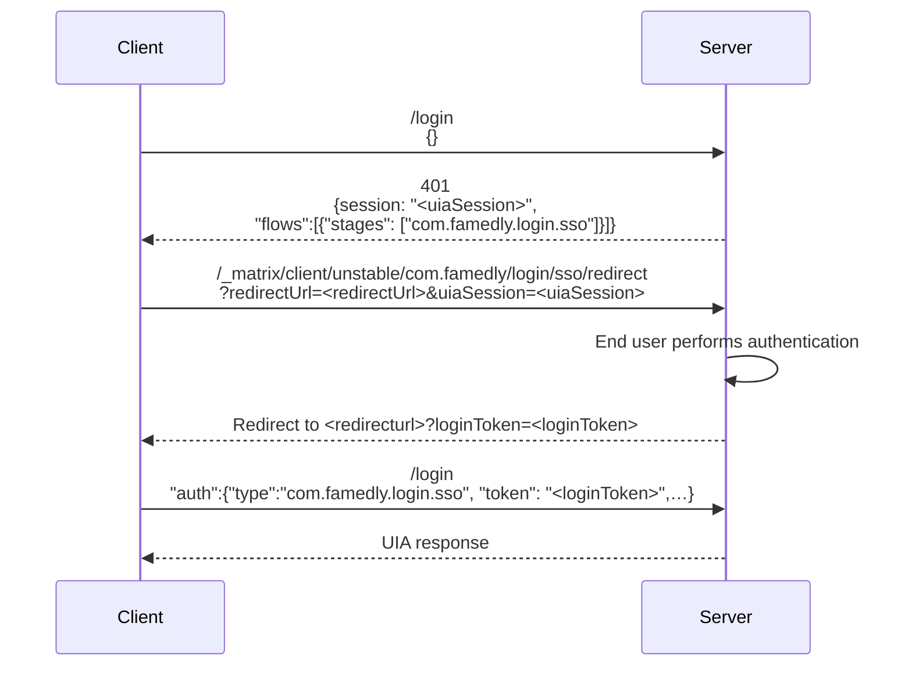

# UIA-Proxy
This is a login service that implements UIA (User Interactive Auth) for matrix servers. It allows high customization and easy development of new stages and password providers.

The service is implemented in **TypeScript** and executed in **Node.js** runtime.

## Prerequisites
To compile, build, test and run the service from the source code, you will need the following tools:

|          | Debian / Ubuntu          | macOS                   | Purpose      |
|----------|        :-                |   :-                    |         :-   |
| git      | `sudo apt install git`   | `brew install git`      | - clone repo |
| Node.js  | `sudo apt install nodejs`|  `brew install node`    | - compile,<br />- build,<br />- test,<br />- run service<br />on your machine |
| Docker   | s. [for Debian](https://docs.docker.com/engine/install/debian/#install-using-the-repository) / [for Ubuntu](https://docs.docker.com/engine/install/ubuntu/)<br />Then add yourself to the _docker_ group:<br />`sudo groupadd docker`<br />`sudo usermod -aG docker $USER`<br />to be able to run `docker` comand without _sudo_ | [Install&nbsp;Docker&nbsp;desktop](https://docs.docker.com/desktop/install/mac-install/) | - build image<br />- run service in container              |
| sed  | `sudo apt install sed`  | `brew install gnu-sed` | - used in build scripts  |

> :warning: **NOTE**: Correct installation of **Node.js** and **Docker** will automatically provide all other required tools and commands (like `npm`, `tsc`, `docker compose` etc.). The build has also proven to work fine with all popular shells like bash, zsh etc.

Aside of that you will need:
- an editor or IDE of your choice;
- an internet connection, to allow that tools to download required dependencies and docker images.

## Working with project
### Get the source
Clone the repository and `cd` into project root directory:
```bash
git clone git@github.com:famedly/uia-proxy.git
cd uia-proxy
````
> :warning: **IMPORTANT**: all commands below should be executed from this directory!

### Install package
Install node package `uia-proxy` along with all dependencies and build the project:

```bash
npm install
npm run build
```
Next you may want to create a `config.yaml` file, based on the `config.sample.yaml` file and edit it to your needs (see [Configuration](#configuration)) or just run the service with the default configuration (see [Run the service](#run-the-service)).

### Understand the directory structure

#### Code base
Just cloned (before `npm install` and `npm run build` are executed) repository of the `uia-proxy` project should look like this:
````console
.
├── .git                - you don't want to mess around with this directory!
│   └── ...
├── .github             - GitHub related stuff
│   └── ...
├── npm-scripts         - npm build helper scripts 
│   └── ...
├── src                 - project sources
│   └── ...
├── test                - project unit tests
│   └── ...
├── typings             - TypeScript definition manager 
│   └── ...
├── utils               - utility scripts
│   └── ...
├── .dockerignore       - keeps the docker image clean
├── .gitignore          - keeps the codebase clean
├── .mocharc.yml        - Mocha (JS test framework) configuration
├── .typos.toml         - typos (source code spell checker) configuration
├── CHANGELOG.md        - should be self-explanatory ;)
├── Dockerfile          - defines docker image build
├── LICENSE             - text of GNU GPL 3
├── README.md           - this file
├── config.sample.yaml  - configuration template
├── docker-run.sh       - entry point for docker image
├── package-lock.json   - dependency versions lock
├── package.json        - package manifest
├── tsconfig.json       - TypeScript configuration
└── tslint.json         - lint configuration

````
#### Transient artifacts
Beyond of that code base files and directories many other transient directories and files will be created during that installation, build, run and test process (s. [Install package](#install-package), [Run the service](#run-the-servicen) and [Execute unit tests](#execute-unit-tests)):

**In the project root directory**:
````console
├── build       <1>
│   └── ...
├── data        <2>
│   ├── logs            <2.1>
│   │   ├── .284010c9f73de2829520daca902bf2ddd0eb4be8-audit.json
│   │   ├── .d7b434cf746ffe1c6592127a3cf652d0a3eaac8f-audit.json
│   │   └── uia-proxy-2023-09-28.log
│   ├── usernamemap     <2.2>
│   │   ├── 000009.log
│   │   ├── CURRENT
│   │   ├── IDENTITY
│   │   ├── LOCK
│   │   ├── MANIFEST-000008
│   │   ├── OPTIONS-000006
│   │   └── OPTIONS-000011
│   └── config.yaml     <2.3>
├── node_modules  <3>
│   └── ...
├── config.yaml   <4>
````
- <1> - contains compiled sources
- <2> - serves as a mock up of the Docker volume, which is mounted into container in the production environment. Contains:
  - <2.1> - `logs` directory, where the service stores the audit and rotated log files.
  - <2.2> - `usernamemap` directory, where the data base of the UseNameMapper is stored.
  - <2.3> - `config.yaml` file. This is the configuration of the service running in docker container.
- <3> - contains downloaded node module dependencies.
- <4> - `config.yaml` file. This is the configuration of the service running directly on your machine.

That `./data/config.yaml` (<2.3>) and `./config.yaml` (<4>) files are created authomatically on `npm run up` and `npm run start` as a copy of the source template file `config.sample.yaml`. After copying few entries are being automatically modified for you, mainly to adjust the relative paths and the port binding of the web server to the appropreative test run environment. However, if you then edit that files manually (and that is exactly what you most likely want to do!), they will NOT be overwritten on the subsequent runs, as long as you not change the source file. (See [./npm-scripts/start.sh](./npm-scripts/start.sh) and [./npm-scripts/up.sh](./npm-scripts/up.sh)).

**In your local Docker registry**:
````console
$ docker images
REPOSITORY        TAG       IMAGE ID       CREATED          SIZE
local/uia-proxy   latest    178a4b277789   14 minutes ago   255MB

$ docker container ls
CONTAINER ID   IMAGE             COMMAND            PORTS                    NAMES
9dde65b153cf   local/uia-proxy   "/docker-run.sh"   0.0.0.0:9740->9740/tcp   test-uia-proxy
````

You are free to delete any of them, if needed (see [How to clean up](#how-to-clean-up)). Depending on what you have deleted, you may need to repeat particular build steps in order to get the service running again. 

### Run the service
Once the package has been successfully installed, you can use the appropriate npm scripts to start the service in few different ways. Each of these scripts will automatically trigger the source code compilation or build of a Docker image if necessary.

- `npm run start` - service will run directly on your machine, which is usefull for testing or configuration tuning. All you need for this is **Node.js**. Beside of the environment setup made by the script, this is equivalent to `node ./build/src/index.js`
> :warning: Started in this way, the Node.js process will attach **stdin**, **stdout** and **stderr** to your TTY session, so you will get all the log output from the service directly in your console.<br />To stop the service you may send SIGINT ( &lt;ctrl&gt;+c ) from your keyboard.

<details>
  <summary>Click to see: Output of 'npm run start'.</summary>

````console
$ npm run start              

> uia-proxy@0.8.5 start
> ./npm-scripts/start.sh


> uia-proxy@0.8.5 build
> tsc

Sep-29 01:42:11.166 [StageHandler (login)] info: Loading stages...
Sep-29 01:42:11.205 [Stage m.login.password] info: Loading password providers...
Sep-29 01:42:11.206 [StageHandler (password)] info: Loading stages...
Sep-29 01:42:11.207 [Stage m.login.password] info: Loading password providers...
Sep-29 01:42:11.207 [StageHandler (deleteDevice)] info: Loading stages...
Sep-29 01:42:11.207 [Stage m.login.password] info: Loading password providers...
Sep-29 01:42:11.208 [StageHandler (deleteDevices)] info: Loading stages...
Sep-29 01:42:11.208 [Stage m.login.password] info: Loading password providers...
Sep-29 01:42:11.208 [StageHandler (uploadDeviceSigningKeys)] info: Loading stages...
Sep-29 01:42:11.208 [Stage m.login.password] info: Loading password providers...
Sep-29 01:42:11.218 [Webserver] info: Webserver listening on localhost:9740
^CSep-29 01:42:22.079 [Webserver] info: Shutting down
````

</details>

- `npm run up` - service will run in docker container. This is how the service should be run in a production environment. For this you need also to have **Docker** installed on your machine. But once the docker image is built, you do not need **Node.js** anymore to run it, since **Node.js** is packaged in that docker image.

<details>
  <summary>Click to see: Output of 'npm run up'.</summary>

````console
$ npm run up

> uia-proxy@0.8.5 up
> ./npm-scripts/up.sh


> uia-proxy@0.8.5 build
> tsc

[+] Building 0.8s (20/20) FINISHED                                                              docker:desktop-linux
 => [internal] load .dockerignore                                                                               0.0s
 => => transferring context: 118B                                                                               0.0s
 => [internal] load build definition from Dockerfile                                                            0.0s
 => => transferring dockerfile: 723B                                                                            0.0s
 => [internal] load metadata for docker.io/library/alpine:latest                                                0.7s
 => [internal] load metadata for docker.io/library/node:alpine                                                  0.6s
 => [internal] load build context                                                                               0.0s
 => => transferring context: 459.82kB                                                                           0.0s
 => [builder 1/9] FROM docker.io/library/node:alpine@sha256:c22c79b530c8b1a3e8d31e9af6e7fc8e17b1a7555ceb762b66  0.0s
 => [stage-1 1/5] FROM docker.io/library/alpine@sha256:eece025e432126ce23f223450a0326fbebde39cdf496a85d8c01629  0.0s
 => CACHED [stage-1 2/5] RUN apk add --no-cache ca-certificates nodejs                                          0.0s
 => CACHED [builder 2/9] RUN apk add --no-cache git make gcc g++ python3 linux-headers                          0.0s
 => CACHED [builder 3/9] RUN mkdir /src                                                                         0.0s
 => CACHED [builder 4/9] COPY package.json /src                                                                 0.0s
 => CACHED [builder 5/9] COPY package-lock.json /src                                                            0.0s
 => CACHED [builder 6/9] WORKDIR /src                                                                           0.0s
 => CACHED [builder 7/9] RUN npm install                                                                        0.0s
 => CACHED [builder 8/9] COPY . /src                                                                            0.0s
 => CACHED [builder 9/9] RUN npm run build                                                                      0.0s
 => CACHED [stage-1 3/5] COPY --from=builder /src/build /opt/uia-proxy                                          0.0s
 => CACHED [stage-1 4/5] COPY --from=builder /src/node_modules /opt/uia-proxy/node_modules                      0.0s
 => CACHED [stage-1 5/5] COPY docker-run.sh /docker-run.sh                                                      0.0s
 => exporting to image                                                                                          0.0s
 => => exporting layers                                                                                         0.0s
 => => writing image sha256:612847cd09ca0ecf0cf2e8b284ba213b0962b9978b5fa7829e995af8e782667e                    0.0s
 => => naming to docker.io/local/uia-proxy                                                                      0.0s

What's Next?
  View a summary of image vulnerabilities and recommendations → docker scout quickview
    ✓ SBOM of image already cached, 396 packages indexed

  Target     │  local://local/uia-proxy:latest  │    0C     1H     0M     0L   
    digest   │  612847cd09ca                    │                              
  Base image │  alpine:3                        │    0C     0H     0M     0L   

What's Next?
  View vulnerabilities → docker scout cves local://local/uia-proxy:latest
  Include policy results in your quickview by supplying an organization → docker scout quickview local://local/uia-proxy:latest --org <organization>

b0cfcf043ea4f14f024cc011cdd4033b62273bac21724345cb6ee45a656bfaa9

======================= Container is now up and running ================

          Access server:  telnet localhost 9740
                     or:  curl localhost:9740

              View logs:  less +F ./data/logs/uia-proxy-2023-09-29.log
       Login into shell:  docker exec -it test-uia-proxy sh
         Stop container:  docker stop test-uia-proxy
  Remove image manually:  docker image -rm local/uia-proxy

========================================================================
````

</details>

After that service should be running in docker container. You can check and stop it as following:

````bash
# Check container status
$ docker container ls
CONTAINER ID   IMAGE             COMMAND            PORTS                    NAMES
9dde65b153cf   local/uia-proxy   "/docker-run.sh"   0.0.0.0:9740->9740/tcp   test-uia-proxy

# Stop container
$ docker stop test-uia-proxy
````

:warning: **IMPORTANT NOTE**<br/>The container is started detached as following:

````bash
docker run -d --rm \
        --name test-uia-proxy \
        --hostname test-uia-proxy \
        -v ./data:/data \
        -p 9740:9740 \
        local/uia-proxy
````
> That `--rm` flag instructs Docker to remove the container as soon as it stopps, which is good for keeping your system clean. If for some reason you need to keep the stopped container, you may run it manually or  just modify that command in [up.sh](./npm-scripts/up.sh) script.

In both cases (standalone or run in container) the service will accept HTTP connections on _localhost:9740_, so if everything works properly, you should be able to access it by navigating your browser to this URL or directly, i.e. like this:
````console
$ curl localhost:9740
<!DOCTYPE html>
<html lang="en">
<head>
<meta charset="utf-8">
<title>Error</title>
</head>
<body>
<pre>Cannot GET /</pre>
</body>
</html>
$
````

### Execute unit tests
The project make extensive use of Mocha JavaScript unit test framework. You can run all unit tests at once:
````bash
npm run test
````
<details>
  <summary>Click to see: Example of unit tests output.</summary>

````console
$ npm run test

> uia-proxy@0.8.5 test
> npm run-script build && mocha


> uia-proxy@0.8.5 build
> tsc

Sep-28 18:50:00.230 [Log] warn: Log set to silent

  ✔ PasswordProvider dummy Should validate, if the configured password matches: 1ms
  ✔ PasswordProvider dummy Should reject, if the configured password does not match: 0ms
...
There are 1 handle(s) keeping the process running

# DNSCHANNEL
node:internal/async_hooks:202
node:internal/dns/utils:79
node:internal/dns/utils:74
...

  111 passing (1s)
$
````  
</details>

See [Documentation on mochajs.org](https://mochajs.org/) for more details on how to use **Mocha**.

### Keep an eye on vulnerabilities!
Like the vast majority of Node.js and Docker based projects, also the `uia-proxy` project relies on a bunch of other open source Node.js modules and Docker images. Each of these may contain vulnerabilities that may be discovered even after the release of a particular version of this project. Fortunately both Node.js and Docker now provide vulnerability scanners (`npm audit` and `docker scout`), which we have integrated into the build.

<details>
  <summary>Click to see: How 'npm audit' findings looks like.</summary>

````console
$ npm audit
# npm audit report

get-func-name  <2.0.1
Severity: high
Chaijs/get-func-name vulnerable to ReDoS - https://github.com/advisories/GHSA-4q6p-r6v2-jvc5
fix available via `npm audit fix`
node_modules/get-func-name

1 high severity vulnerability

To address all issues, run:
  npm audit fix
````

</details>

<details>
  <summary>Click to see: How 'docker scout' findings looks like.</summary>

````console
$ ocker scout cves local://local/uia-proxy:latest
    ✓ SBOM of image already cached, 396 packages indexed
    ✗ Detected 1 vulnerable package with 1 vulnerability


## Overview

                    │          Analyzed Image           
────────────────────┼───────────────────────────────────
  Target            │  local://local/uia-proxy:latest   
    digest          │  178a4b277789                     
    platform        │ linux/arm64                       
    vulnerabilities │    0C     1H     0M     0L        
    size            │ 81 MB                             
    packages        │ 396                               


## Packages and Vulnerabilities

   0C     1H     0M     0L  get-func-name 2.0.0
pkg:npm/get-func-name@2.0.0

    ✗ HIGH CVE-2023-43646 [Inefficient Regular Expression Complexity]
      https://scout.docker.com/v/CVE-2023-43646
      Affected range : <2.0.1                                        
      Fixed version  : 2.0.1                                         
      CVSS Score     : 8.6                                           
      CVSS Vector    : CVSS:3.1/AV:N/AC:L/PR:N/UI:N/S:C/C:N/I:N/A:H  
    


1 vulnerability found in 1 package
  LOW       0  
  MEDIUM    0  
  HIGH      1  
  CRITICAL  0  


What's Next?
  View base image update recommendations → docker scout recommendations local://local/uia-proxy:latest
````

</details>

> :warning: While building the project, it is crucial to pay attention to the findings of that scanners and to take action if necessary! 

### Clean up
To reclaim disk space, cosumed by transient artifacts created during build and test runs, you can run:
````bash
npm run clean
````

The script will help you to delete (interactively!):
  - test **docker container** and **docker image**. Note that the Docker image which is used by the test container may consume a significant portion of your disk storage space. Therefore, you may want to reclaim this space once that temporary test artifacts are no longer needed.
  - `data` subdirectory in the project's root directory. It is created by `npm run start` and `npm run up` and serves as a mock up for the docker volume `data`, which is expected to be mounted into docker container in the productive environment.
  - `config.yaml` file, which is automatically created by `npm run start` and serves as a configuration file for the standalon started service.
  - `build` and `node_modules` subdirectories in the project root directory. They are created automatically by `npm run build` and `npm install` respectively for the compiled sources and for downloaded dependency modules.

  ````bash
  $ npm run clean

> uia-proxy@0.8.5 clean
> ./npm-scripts/clean.sh

REPOSITORY        TAG       IMAGE ID       CREATED              SIZE
local/uia-proxy   latest    8bc087992ec0   About a minute ago   255MB

CONTAINER ID   IMAGE             COMMAND            CREATED              STATUS              PORTS                    NAMES
14e24d4b01ac   local/uia-proxy   "/docker-run.sh"   About a minute ago   Up About a minute   0.0.0.0:9740->9740/tcp   test-uia-proxy

About to remove docker container and image. Are you sure ? [y/N]
Nothing deleted.
About to remove ./data along with all logs and configs. Are you sure ? [y/N]
Nothing deleted.
About to remove 'config.yaml'. Are you sure ? [y/N]
Nothing deleted.
About to remove 'build' and 'node_modules'. Are you sure ? [y/N]
Nothing deleted.
````

## Configuration
### Logs and log rotation
`UIA-proxy` make use of [Winston](https://www.npmjs.com/package/winston) logging framework, allowing you to configure it according to your needs. The configuration is provided in `logging:` base object as following:
````yaml
# Logging configuration
logging:
  # Console logging settings
  console: info
  # Timestamp formatting in log entries
  lineDateFormat: "MMM-D HH:mm:ss.SSS"
  # Files to write logs to. Written files will be rotated.
  files:
      # Filename to be used to log to. 
      # This filename can include the %DATE% placeholder which will include the formatted datePattern 
      # at that point in the filename. If no placeholder provided, the date will be appended to the filename. 
    - file: "uia-proxy-%DATE%.log"
      # Directory where the log files are stored, defaults to '.' (current dir), if undefined or empty.
      # IMPORTANT: The directory MUST exist and be writeable - otherwise service will not start!
      # NOTE: You can not use '/dev/null', since log rotation requires persistence. 
      #       Just remove the wohl file entry, if no log file required, i.e 'files: []'.
      dir: "/data/logs"
      # Amount of rotated log files to keep, or maximum age in days if d is appended
      maxFiles: "14d"
      # Maximum size of a log file.
      # Can be number of bytes, or number of kb, mb, or gb if k, m or g is appended
      maxSize: "50m"
      # The date format used for rotating.
      # e.g. 'HH' results in 24 log files that are picked up and appended each day
      datePattern: "YYYY-MM-DD"
````
At the top level:
-  `console:` defines desired logging level: `error | warn | info | verbose | debug | silly`.
- `lineDateFormat:` allows to set desired timestamp format, which is then used for all log entries.

In addition to that console logging you can configure the log output to go into multiple log files by adding as many `file:` elements to the `files: []` list as needed. That log files will be automatically rotated on a daily base according to the configured thresholds. Each element should provide:

- `file:` - filename, that can include '%DATE%' placeholder, which will be replaced with the current date during the file rotation. If no placeholder provided, the current date will be appended to the filename i.e. `my-custom.log` -> `my-custom.log.2023-10-29`

- `datePattern:` - format for that date replacement.<br />:warning: Do not confuse it with `lineDateFormat` from the top level! `datePattern:` only applies to the date part of the filename.

- `dir:` - path to the directory, where the log files should be stored. You can provide both absolut and relative path. The last one will be resolver relative to the current directory, from where the **Node.js** process has been started.

- `maxFiles:` - the maximum number (or maximum age in days if `d` is added) of rotated files to be kept in that directory.

- `maxSize:` - the maximum allowed size of a log file specified as:

| suffix | unit  |
|--------|  :-   |
|        | bytes |
| k      | kb    |
| m      | mb    |
| g      | gb    |

:warning: **IMPORTANT NOTES**

- The effectively used filename is a concatination of that `dir:` and `file:`, but you don't need to worry about the trailing separator in the directory name. It will be handled automaticaly. Even if it is possible, you are strongly advised NOT to mix the filename with the parts of the desired directory path. Just keep it separateed. If not specified at all, the directory path defaults to `./` (current directory). 

- The resulting directory MUST exist, and the **Node.js** process MUST have write permissions, otherwise it will fail right on start up.

- You can NOT specify `/dev/null` as the directory because the logging framework should be able to not only **write** but also **read** the files to rotate them. If no log files required at all, you can just remove all entries from the `files:` list and keep it empty, i.e. `files: []`.

- Any missconfiguration of the directory path and|or filename may cause, that the service will try to create the log files in some unexpected place in your file system. In a production environment it may become a critical issue, if it runs with the **root** privileges. For this reason, you should consider running it in your production environment in an unprivileged user context if possible.

### Stages and flows
The configuration of stages and flows can seem rather complex at first, however, it is designed to eliminate redundant configuration.

First off, inside of the `uia` base object all the different endpoints are configured. Each endpoint configuration has a `stages` and a `flows` attribute. In the `stages` attribute lies the configuration for the different stages, and in the flows attribute the config for the different flows.
```yaml
uia:
  endpoint:
    stages:
      # <stages config>
    flows:
      # <flows config>
```

To configure the flows, you provide an array of different possible stages, as follows:
```yaml
uia:
  endpoint:
    stages:
      # <stages config>
    flows:
      - stages:
        - m.login.foo
        - m.login.bar
      - stages:
        - m.login.foo
        - m.login.dummy
```

In this example the `m.login.bar` stage is optional.

Now, some stages require additional configuration (e.g. password providers for `m.login.password`). As such, the stages object takes as key the stage it refers to and its content is the respectives stage config. For example:
```yaml
uia:
  endpoint:
    stages:
      m.login.foo:
        species: fox
        food: bunny
      m.login.bar:
        emailprovider: gmail
    flows:
      - stages:
        - m.login.foo
        - m.login.bar
      - stages:
        - m.login.foo
        - m.login.dummy
```

Note that `m.login.dummy` does not appear in the stages config, as this stage doesn't require a configuration.

If you need to repeat configuration for a stage or an endpoint, you can use YAML's built-in templating functionality, known as anchors and aliases.

```yaml
uia:
  endpoint:
    stages:
      # Here we define an anchor named foxhole
      m.login.foo: &foxhole
        species: fox
        food: bunny
      m.login.bar:
        emailprovider: gmail
    flows:
      - stages:
        - m.login.foo
        - m.login.bar
      - stages:
        - m.login.foo
        - m.login.dummy
  otherEndpoint: &endpoint
    stages:
      # Here we refer (i.e. alias) to the previously defined anchor. The config
      # of this m.login.foo will be the same as the previous one
      m.login.foo: *foxhole
    flows:
      - stages:
        - m.login.foo
        - m.login.dummy
  # Here we reuse an entire endpoint configuration
  thirdEndpoint: *endpoint
```


### Stage configurations
#### m.login.dummy
The stage `m.login.dummy` does not need any configuration.

#### m.login.password
The config for the `m.login.password` stage looks as follows:
```yaml
passwordproviders:
  # <password providers config>
```

The password providers config consists out of the type (the key) and its respective config (the value). For example:
```yaml
passwordproviders:
  ldap:
    url: ldap://localhost
    # ...additional config needed for ldap...
  dummy: # DO NOT USE THIS IN PRODUCTION
    validPassword: foxies
```

#### com.famedly.login.welcome_message
The config for the `com.famedly.welcome_message` contains either a `welcomeMessage` or a `file` where to read the message from.
If both are given then the file is used. For example:
```yaml
file: /path/to/welcome/message.txt
```

#### com.famedly.login.sso
This stages authenticates using tokens granted by performing authentication with OpenID Connect. You
need to configure one or more providers and, optionally, callback URLs. If there are multiple stages
of this type, then the ones with the same callback URLs are assumed to be the same configured providers,
so make sure that the config for those is the exact same. It is recommended to use the config templateing
described above for this.

:warning: **IMPORTANT**:  The configured provider id is, by default, used to generate the usernames of the resulting
mxids. If this config option is changed, then the provider namespace *must* be set to what the provider
id was previously, else the generated mxids change and thus the matrix users will get lost. Additionally,
the provider id and provider namesapce must be valid characters for mxid, if the `usernameMapper.mode`
is `plain`, so for example all lowercase `a-z` is fine.

The `type` can be set to either `m.login.sso` or `com.famedly.login.sso` depending on what stage name should be reported to clients

An example configuration could look as following:
```yaml
# The default OpenID provider to use when one wasn't specified
default: foo
# Configuration of the endpoints (optional)
endpoints:
  # The base URL for the OIDC redirects
  redirect: /_matrix/client/unstable/com.famedly/login/sso/redirect
  # The URL for the OIDC callbacks
  callback: /_uiap/oicd/callback
  # Send redirects as JSON bodies instead of 301 responses
  json_redirects: false

# Configurations for identity providers.
providers:
  foo:
    # The issuer URL of this OpenID provider. Used for autodiscovery.
    issuer: "https://login.provider.com"
    # The relying party identifier at the OpenID provider
    client_id: "uia"
    # The secret which authenticates this relying party at the OP
    client_secret: "lak4sjd34hfuwie84bzvou3eqp1384znv1"
    # The OpenID scope value. Determines what information the OP sends.
    scopes: "openid"
    # Whether to enable autodiscovery. It's recommended to enable it.
    autodiscover: false
    # If true, perfom token introspection
    introspect: true
    # These endpoints below will be set automatically if autodiscovery is enabled
    # The authorization endpoint where the end user performs auth
    authorization_endpoint: "https://login.provider.com/auth"
    # The token endpoint where an auth code is exchanged for a token
    token_endpoint: "https://login.provider.com/token"
    # The provider's user info endpoint
    userinfo_endpoint: "https://login.provider.com/userinfo"
    # The endpoint to perform token introspection at
    introspection_endpoint: "https://login.provider.com/introspect"
    # The URL where the OP publishes its JWK set of signing keys
    jwks_uri: "https://login.provider.com/jwks"
    # The JWT claim which identifies the user. Defaults to "sub".
    subject_claim: "sub"
    # If set, specifies the claim used to set the user's display name
    name_claim: "name"
    # If set, specifies the claim used to set synapse's admin status of a user.
    admin_claim: "is_admin"
    # A map of JWT claims to their expected values.
    expected_claims:
      can_login: true
      organization_id: "my_organization"
    # (optional) the namespace used for this provider to generate the mxids.
    # Defaults to the providr id
    # Set to false to disable namespacing for this provider
    namespace: foo
  # Provider using autodiscovery
  bar:
    issuer: "https://accounts.barprovider.com"
    client_id: "matrix"
    client_secret: "ynx4fwq34ushjvr84omibh3rdc1384mai1"
    scopes: "openid profile"
    autodiscover: true
    subject_claim: "preferred_username"
    expected_claims:
      is_polite: true
```

##### Notes for client developers
This login method works mostly similarly to `m.login.sso`, with a few notable exeptions. Most importantly that the token received must be sent to the same login type that prompted the SSO login, *not* a distinct login type like `m.login.token`. The sequence diagram for the flow looks as follows ():



When a client receives a `com.famedly.login.sso` stage in one of the available flows for login, the client can initiate completion of this stage by sending a GET request to the endpoint `/_matrix/client/unstable/com.famedly/login/sso/redirect<br>?redirectUrl=<redirectUrl>&uiaSession=<uiaSession>`, where `redirectUrl` is a URL the client will be redirected to with a token when the flow is finished, and `uiaSession` is the ID of the currently active UIA session.

The client will be redirected to the OpenID Provider, perform authentication, and be redirected to the redirectUrl if it succeeds. The received token should be sent to the server as a `com.famedly.login.sso` stage response.

A few error codes are used to communicate distinct meanings:
- `M_FORBIDDEN`: The submitted token is not valid for the UIA session
- `M_UNAUTHORIZED`: The user attempting to authorize does not have the claims configured in `expected_claims` associated with their identity.
- `F_TOKEN_EXPIRED`: Token introspection determined that the token is no longer active

#### `com.famedly.login.crm`
This stage accepts a JWT signed by the Famedly CRM, fetches the public key from the CRM, and validates the
token, checking that certain claims have expected values.
```yaml
# The base URL of the CRM. Used for performing API calls.
url: "https://crm.domain.example/path/"
# The expected pharmacy ID claim
pharmacy_id: "<pharmacy_identifier>"
```


### Password provider configurations
#### dummy
The `dummy` password provider is **NOT** meant for production. It exists only for testing purposes. It has the following configuration:
```yaml
# the password which is valid
validPassword: foxies
```

#### ldap
The `ldap` password provider authenticates a user with ldap and, optionally, re-writes their mxid to the random hash. It needs a search user to be able to log in as users via their persistent ID. Its configuration can look as follows:
```yaml
# The URL endpoint of ldap
ldap: ldap://localhost
# The base DN of the users
base: dc=localhost,dc=localdomain
# the bind DN of the search user
bindDn: cn=search,dc=localhost,dc=localdomain
# the bind password of the search user
bindPassword: super secret
# the group of deactivated users
deactivatedGroup: cn=deactivatedUsers,ou=groups,dc=famedly,dc=de
# The attribute map of the ldap attributes
attributes:
  # The username of the user
  uid: cn
  # The persistent ID of the user, to generate the random mxid of
  persistentId: uid
```

## Endpoints
- `login`: Login endpoint called upon logging in
- `password`: Endpoint called when changing a password
- `deleteDevice`: Endpoint called when deleting a single device
- `deleteDevices`: Endpoint called when deleting multiple devices
- `uploadDeviceSigningKeys`: Endpoint called when uploading cross-signing keys
