# UIA-Proxy
This is a login service that implements UIA (User Interactive Auth) for matrix servers. It allows high customization and easy development of new stages and password providers.

## Installation
First clone the repository, then install it:
```bash
git clone git@gitlab.com:famedly/famedly-login-service.git
cd famedly-login-service
npm install
npm run build
```
Next create a `config.yaml` file, based on the `config.sample.yaml` file and edit it to your needs.

## Configuration
The configuration of stages and flows can seem rather complex at first, however, it is designed to eliminate redundant configuration.

First off, inside of the `uia` base object all the different endpoints are configured. Each endpoint configuration has a `stages` and a `flows` attribute. In the `stages` attribute lies the configuration for the different stages, and in the flows attribute the config for the different flows.
```yaml
uia:
  endpoint:
    stages:
      # <stages config>
    flows:
      # <flows config>
```

To configure the flows, you provide an array of different possible stages, as follows:
```yaml
uia:
  endpoint:
    stages:
      # <stages config>
    flows:
      - stages:
        - m.login.foo
        - m.login.bar
      - stages:
        - m.login.foo
        - m.login.dummy
```

In this example the `m.login.bar` stage is optional.

Now, some stages require additional configuration (e.g. password providers for `m.login.password`). As such, the stages object takes as key the stage it refers to and its content is the respectives stage config. For example:
```yaml
uia:
  endpoint:
    stages:
      m.login.foo:
        species: fox
        food: bunny
      m.login.bar:
        emailprovider: gmail
    flows:
      - stages:
        - m.login.foo
        - m.login.bar
      - stages:
        - m.login.foo
        - m.login.dummy
```

Note that `m.login.dummy` does not appear in the stages config, as this stage doesn't require a configuration.

Now, if you have multiple endpoints with the same stages that would mean you'd have to copy-paste the stage config around. To eliminate that the stage configuration can be templates with in the `stages` object. For that the key is the alias, the `type` is the stage type and the `config` is the stages config. After that, in the stages config of the endpoint, as key the alias can be used. If additional configuration options are set they override those of the template. So the following configuration is equivalent to the one above:

```yaml
stages:
  foxhole:
    type: m.login.foo
    config:
      species: fox
      food: bunny

uia:
  endpoint:
    stages:
      foxhole:
      m.login.bar:
        emailprovider: gmail
    flows:
      - stages:
        - m.login.foo
        - m.login.bar
      - stages:
        - m.login.foo
        - m.login.dummy
```

The advantage is, that the configuration can easily be re-used for a different endpoint:
```yaml
stages:
  foxhole:
    type: m.login.foo
    config:
      species: fox
      food: bunny

uia:
  endpoint:
    stages:
      foxhole:
      m.login.bar:
        emailprovider: gmail
    flows:
      - stages:
        - m.login.foo
        - m.login.bar
      - stages:
        - m.login.foo
        - m.login.dummy
  other_endpoint:
    stages:
      foxhole:
        food: burgers # we override the "food" parameter of the config!
    flows:
      - stages:
        - m.login.foo
```

Additionally the `homeserver` config is automatically added to all stage configurations.

Similarly you can also define entire UIA config blobs in `templates`, helpful e.g. if you have multiple
endpoints which require only a password. These can also use stage templates, as such:

```yaml
stages:
  password:
    type: m.login.password
    config:
      passwordproviders:
        ldap:
          url: ldap://localhost
          # and the remaining ldap config

templates:
  password_only:
    stages:
      password:
    flows:
      - stages:
        - m.login.password

uia:
  login: # login endpoint
    password_only:
  password: # password change endpoint
    password_only:
```

As a lot of endpoints probably have the same config option, you can also define a default,
which is used for all endpoints not explicitly defined, as so:
```yaml
stages:
  password:
    type: m.login.password
    config:
      passwordproviders:
        ldap:
          url: ldap://localhost
          # and the remaining ldap config

templates:
  password_only:
    stages:
      password:
    flows:
      - stages:
        - m.login.password

uia:
  default: # default for all endpoints
    password_only:
```

## Stage configurations
### m.login.dummy
The stage `m.login.dummy` does not need any configuration.

### m.login.password
The config for the `m.login.password` stage looks as follows:
```yaml
passwordproviders:
  # <password providers config>
```

The password providers config consists out of the type (the key) and its respective config (the value). For example:
```yaml
passwordproviders:
  ldap:
    url: ldap://localhost
    # ...additional config needed for ldap...
  dummy: # DO NOT USE THIS IN PRODUCTION
    validPassword: foxies
```

### com.famedly.login.welcome_message
The config for the `com.famedly.welcome_message` contains either a `welcomeMessage` or a `file` where to read the message from.
If both are given then the file is used. For example:
```yaml
file: /path/to/welcome/message.txt
```

### com.famedly.login.sso
This stages authenticates using tokens granted by performing authentication with OpenID Connect. You
need to configure one or more providers and, optionally, callback URLs. If there are multiple stages
of this type, then the ones with the same callback URLs are assumed to be the same configured providers,
so make sure that the config for those is the exact same. It is recommended to use the config templateing
described above for this.

**IMPORTANT**:  The configured provider id is, by default, used to generate the usernames of the resulting
mxids. If this config option is changed, then the provider namespace *must* be set to what the provider
id was previously, else the generated mxids change and thus the matrix users will get lost. Additionally,
the provider id and provider namesapce must be valid characters for mxid, if the `usernameMapper.mode`
is `plain`, so for example all lowercase `a-z` is fine.

An example configuration could look as following:
```yaml
# The default OpenID provider to use when one wasn't specified
default: foo
# Configuration of the endpoints (optional)
endpoints:
  # The base URL for the OIDC redirects
  redirect: /_matrix/client/unstable/com.famedly/login/sso/redirect
  # The URL for the OIDC callbacks
  callback: /_uiap/oicd/callback
# Configurations for identity providers.
providers:
  foo:
    # The issuer URL of this OpenID provider. Used for autodiscovery.
    issuer: "https://login.provider.com"
    # The relying party identifier at the OpenID provider
    client_id: "uia"
    # The secret which authenticates this relying party at the OP
    client_secret: "lak4sjd34hfuwie84bzvou3eqp1384znv1"
    # The OpenID scope value. Determines what information the OP sends.
    scopes: "openid"
    # Whether to enable autodiscovery. It's recommended to enable it.
    autodiscover: false
    # The authorization endpoint where the end user performs auth
    authorization_endpoint: "https://login.provider.com/auth"
    # The token endpoint where an auth code is exchanged for a token
    token_endpoint: "https://login.provider.com/token"
    # The provider's user info endpoint
    userinfo_endpoint: "https://login.provider.com/userinfo"
    # The URL where the OP publishes its JWK set of signing keys
    jwks_uri: "https://login.provider.com/jwks"
    # The JWT claim which identifies the user. Defaults to "sub".
    subject_claim: "sub"
    # If set, specifies the claim used to set the user's display name
    name_claim: "name"
    # If set, specifies the claim used to set synapse's admin status of a user.
    admin_claim: "is_admin"
    # A map of JWT claims to their expected values.
    expected_claims:
      can_login: true
      organization_id: "my_organization"
    # (optional) the namespace used for this provider to generate the mxids.
    # Defaults to the providr id
    namespace: foo
# Example using autodiscovery
#   bar:
#     issuer: "https://accounts.barprovider.com"
#     client_id: "matrix"
#     client_secret: "ynx4fwq34ushjvr84omibh3rdc1384mai1"
#     scopes: "openid profile"
#     autodiscover: true
#     subject_claim: "preferred_username"
#     expected_claims:
#       is_polite: true
```

#### Notes for client developers
This login method works mostly similarly to `m.login.sso`, with a few notable exeptions. Most importantly that the token received must be sent to the same login type that prompted the SSO login, *not* a distinct login type like `m.login.token`. The sequence diagram for the flow looks as follows ():

```mermaid
sequenceDiagram
    Client->>Server: /login<br>{}
    Server-->>Client: 401 <br>{session: "<uiaSession>",<br>"flows":[{"stages": ["com.famedly.login.sso"]}]}
    Client->>Server: /_matrix/client/unstable/com.famedly/login/sso/redirect<br>?redirectUrl=<redirectUrl>&uiaSession=<uiaSession>
    Server->>Server: End user performs authentication
    Server-->>Client: Redirect to <redirecturl>?loginToken=<loginToken>
    Client->>Server: /login<br>"auth":{"type":"com.famedly.login.sso", "token": "<loginToken>",…}
    Server-->>Client: UIA response
```



When a client receives a `com.famedly.login.sso` stage in one of the available flows for login, the client can initiate completion of this stage by sending a GET request to the endpoint `/_matrix/client/unstable/com.famedly/login/sso/redirect<br>?redirectUrl=<redirectUrl>&uiaSession=<uiaSession>`, where `redirectUrl` is a URL the client will be redirected to with a token when the flow is finished, and `uiaSession` is the ID of the currently active UIA session.

The client will be redirected to the OpenID Provider, perform authentication, and be redirected to the redirectUrl if it succeeds. The received token should be sent to the server as a `com.famedly.login.sso` stage response.

A few error codes are used to communicate distinct meanings:
- `M_FORBIDDEN`: The submitted token is not valid for the UIA session
- `M_UNAUTHORIZED`: The user attempting to authorize does not have the claims configured in `expected_claims` associated with their identity.

### `com.famedly.login.crm`
This stage accepts a JWT signed by the Famedly CRM, fetches the public key from the CRM, and validates the
token, checking that certain claims have expected values.
```yaml
# The base URL of the CRM. Used for performing API calls.
url: "https://crm.domain.example/path/"
# The expected pharmacy ID claim
pharmacy_id: "<pharmacy_identifier>"
```


## Password provider configurations
### dummy
The `dummy` password provider is **NOT** meant for production. It exists only for testing purposes. It has the following configuration:
```yaml
# the password which is valid
validPassword: foxies
```

### ldap
The `ldap` password provider authenticates a user with ldap and, optionally, re-writes their mxid to the random hash. It needs a search user to be able to log in as users via their persistent ID. Its configuration can look as follows:
```yaml
# The URL endpoint of ldap
ldap: ldap://localhost
# The base DN of the users
base: dc=localhost,dc=localdomain
# the bind DN of the search user
bindDn: cn=search,dc=localhost,dc=localdomain
# the bind password of the search user
bindPassword: super secret
# the group of deactivated users
deactivatedGroup: cn=deactivatedUsers,ou=groups,dc=famedly,dc=de
# The attribute map of the ldap attributes
attributes:
  # The username of the user
  uid: cn
  # The persistent ID of the user, to generate the random mxid of
  persistentId: uid
```

## Endpoints
`login`: Login endpoint called upon logging in
`password`: Endpoint called when changing a password
`deleteDevice`: Endpoint called when deleting a single device
`deleteDevices`: Endpoint called when deleting multiple devices
